

    <h1>INFO 1650 Assignment 1</h1>
    <h3>Boyuan YE - 002839124</h3>

<i>if the images of the markdown file cannot shows, please check the readme.pdf for better view</i>

## Directories and Files
### Page 1 - index.html
This is the index page of the project, click the "Detailed Data" button at the bottom of this page to jump to page 2.
The page includes a Genshin character - Hu Tao's basic information.

### Page 2 - data.html

### resources
All the resources includes audios, videos, images and so on that used to create the website are put in this directory.

### css_file
All the .css files are put here.
* global.css - the css style that used in both index.html and data.html
* index.css - the css style that only used in index.html
* data.css - the css style that only used in data.html

## Tags been Used
### Favicon
    The favicon is defined in the <head> tag, which set the "favicon.ico" as the icon of the website page.
    
    

### Table
    The table is used to illustrate the character's basic attributes.
    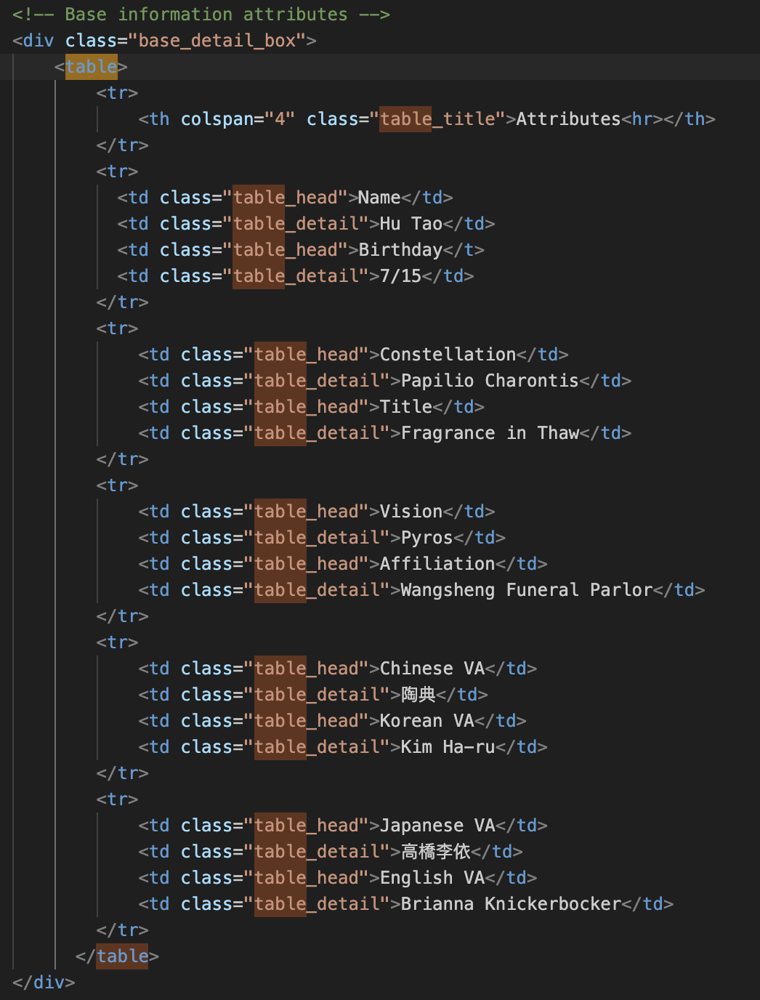
    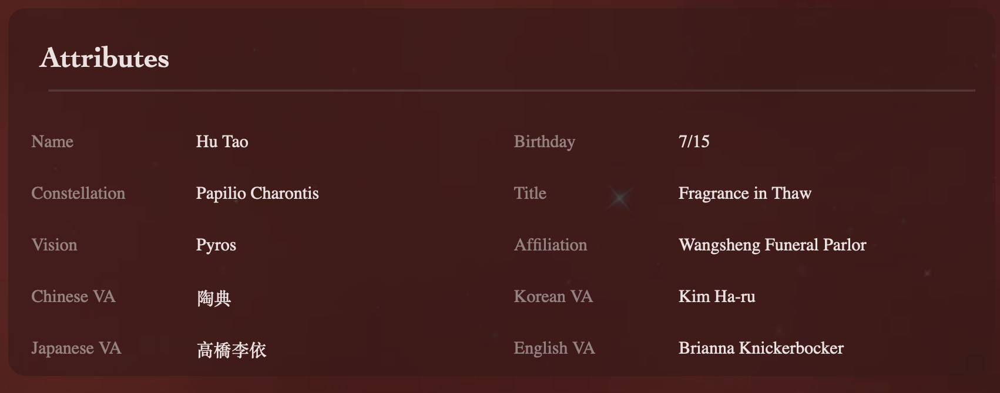

### Form

### header
    The header tag is used.
    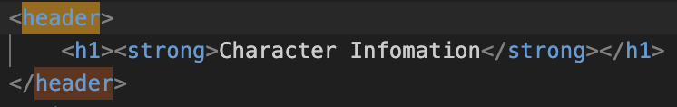

### Images
    The image tags were used at character's base information part, which shows the portrait, elementary icon and level star.
    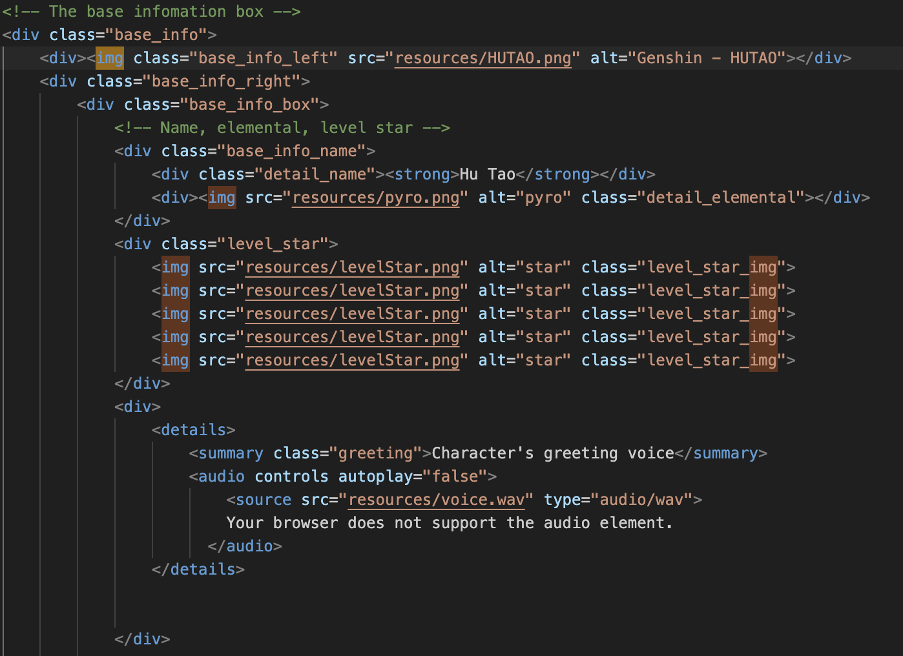

### audio
    The audio tag was used to show the character's greeting voice (in Chinese). It used the default audio control but set the background color to transparent.
    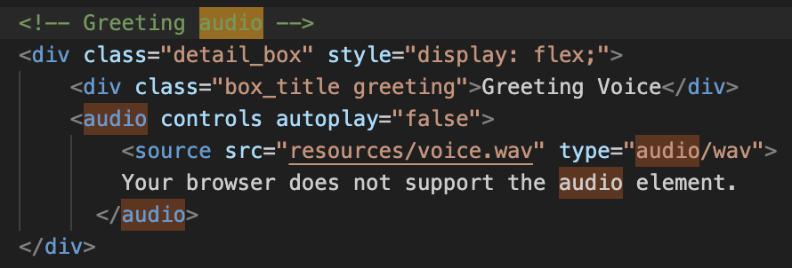
    

### video
    The video tags were used in different part. First is the background of the page, and it also used in the part that describe the character's talent.
    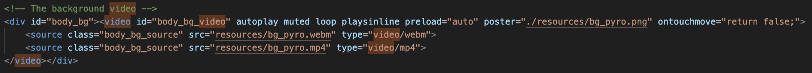
    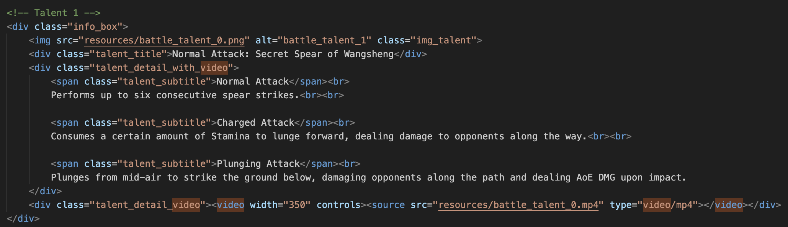
    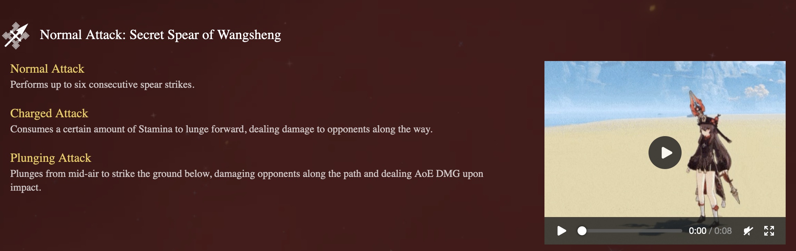

    
### Hyperlink
### Button

### footer & tel & mailto
    The footer tag includes both tel and mailto for contact information, it is located at the bottom of the pages.
    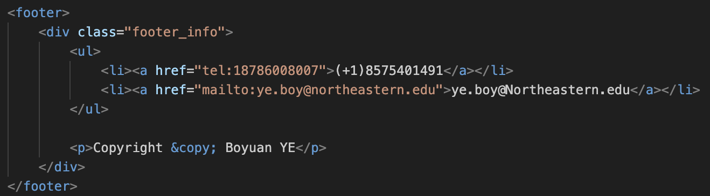
    
    
### summary
    The summary tag is used for the character's introduction.
    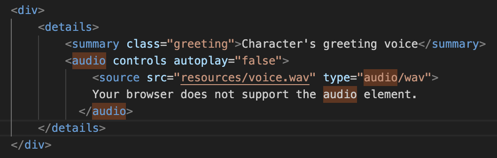
    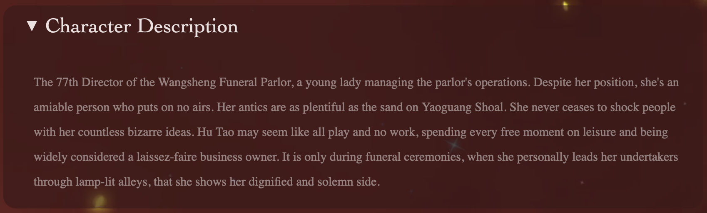
    
### menu
    The menu tag is used to create the side bar for the first page (index.html).
    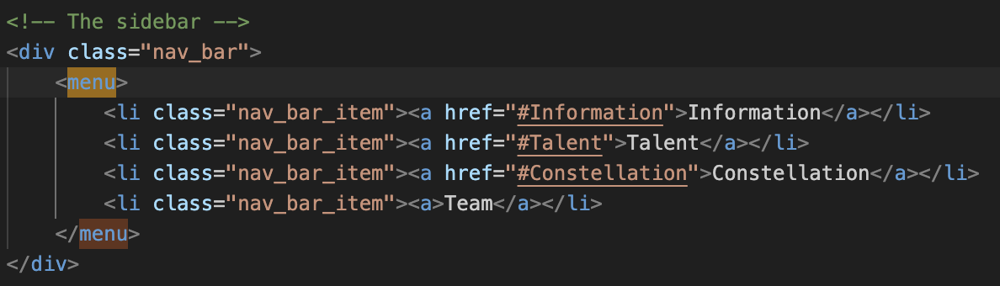
    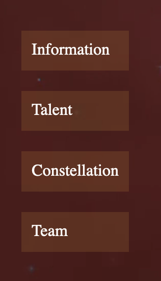
