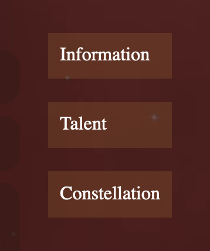

    <h1>INFO 1650 Assignment 1</h1>
    <h3>Boyuan YE - 002839124</h3>

<i>if the images in the markdown file cannot shows, please check the readme.pdf for better view</i>

## Directories and Files
### README.assets
    This is the folder that contains all the images that used in this readme.md file.

### Page 1 - index.html
    This is the index page of the website, click the "Detailed Data" button at the bottom of this page to jump to page 2.
    This page includes a Genshin character - Hu Tao's basic information.

### Page 2 - data.html
    This is the second page of the website, it contains the detail data of the character's talent, click "back" button to back to page 1.
    There is a selector to select which specific data that to show (but the javascript is not used in this page, so the function is not yet avaliable).

### resources
    All the resources includes audios, videos, images etc., that used to create the website are put in this directory.

### css_file
    All the .css files are put here.
    * global.css - the css style that used in both index.html and data.html
    * index.css - the css style that only used in index.html
    * data.css - the css style that only used in data.html

## Tags been Used

### Favicon

    The favicon is defined within the <head> tag, which set the "favicon.ico" as the icon of the website page.

### Table

    The table is used to illustrate the character's basic attributes.

### Form

    The form is create for the user to select which talent's data is to be shown.(but the javascript is not used in this page, so the function is not avaliable)

### header & Images

    The header tag is used in both html file.
    The image tags were used at character's base information part, which shows the portrait, elementary icon and level star.

### audio

    The audio tag was used to show the character's greeting voice. It used the default audio controller but set the background color to transparent.

### video

    The video tags were used in different part. First is the background of both page, it also used in the part that display the character's talent. The video uses the default video controller.

### Hyperlink
    The hyperlink tags were used for switching from different pages and the contact information in index.html.

### Button
    The button is used to jump from data.html to index.html.
    It also used in the <form> control as the submit button.

### footer & tel & mailto
    The footer tag includes both tel and mailto for contact information, it is located at the bottom of both pages. Both of the tel and mail can be clicked.

### summary

    The summary tag is used for the character's introduction.

### menu

    The menu tag is used to create the sidebar for the first page (index.html). Click the title on the sidebar can jump to the specific part of this page.

